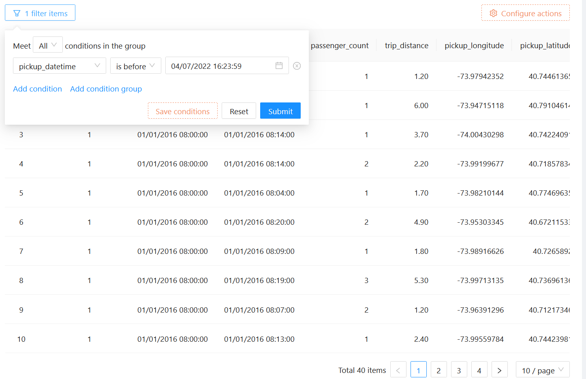
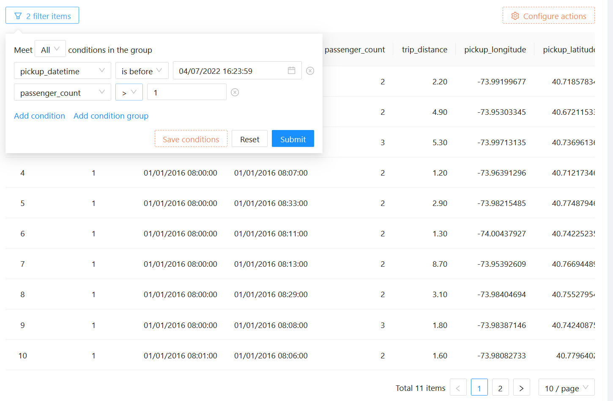
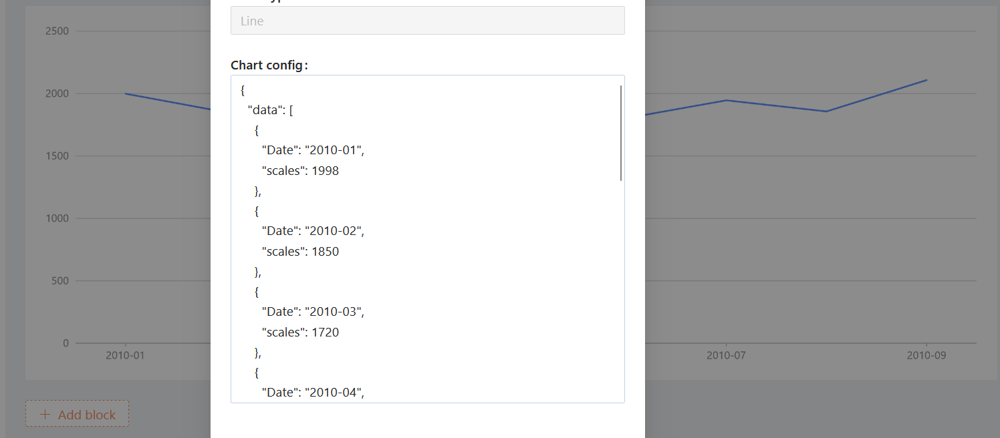
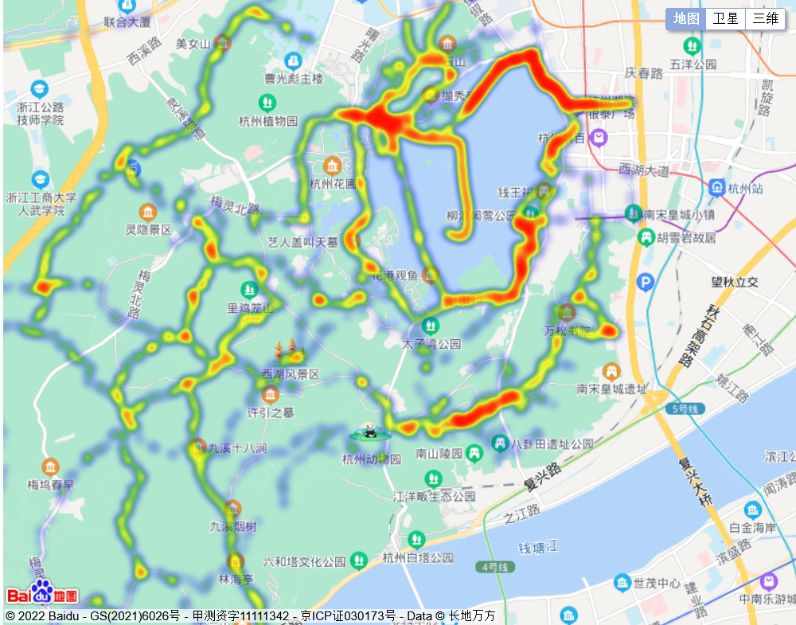
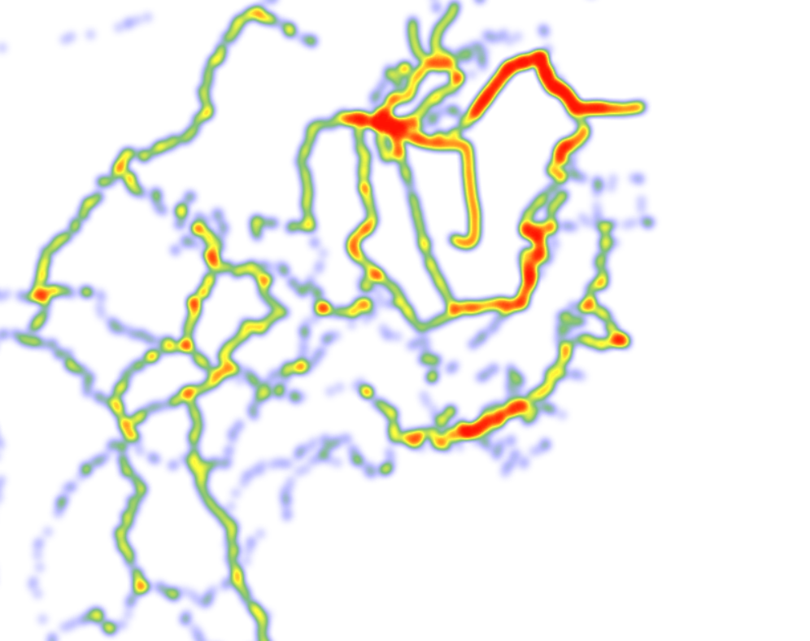

# The Answer

## 思考题

> postgresql 和 timescale 是什么关系？

答: TimescaleDB 是基于 PostgreSQL 的时序数据库, 作为 PostgreSQL 的一个插件存在.

> 低代码平台的底层的基本工作原理？

答:

将复杂的代码编写过程进行提前封装, 底层架构进行提前设计, 将这些复杂的内容包装成可视化的模块. 参照 NocoBase 的架构, NocoBase 将整个低代码平台分为 "客户端" 与 "服务端" 两个部分, 客户端用来完成可视化编辑的工作, 服务端则接受客户端的请求, 并且进行数据库的操作.

- 此时分类讨论:

    1. 界面渲染

        - 从表现形式来看: 低代码需要满足可视化的编辑, 即能让不会编程的人也轻松创建软件, 便需要及时在图形界面上渲染当前操作以及反馈; 参考 amis 的实现: 用户在图形界面上执行的操作, 都会形成一个配置, 令渲染器 / 服务端解析配置, 转换成对应的图形界面元素或组件, 并及时渲染出来.

    2. 交互逻辑的

        - 单一的通过图形化, 也就是拖拽代码块形式的低代码模式, 是无法处理复杂业务逻辑的, 所以多数低代码模式都选择了固化交互行为, 即将常见常用的操作 / 界面 / 模块预制成固定的组件直接使用, 哪怕复杂的逻辑也可以封装成简单的组件, 让用户使用时无感知.

    3. 自定义数据存储

        - 使用关系型数据库; NocoBase 的 "Collections & Fields" 功能中直接创建数据库表, 无需令数据库管理员或业务人员去创建表, 但是会覆盖已经存在的同名表. 同时 NocoBase 提供了用户角色控制.
        - 使用文档型数据库; 以 MongoDB 为例, 用户创建一个自定义表的时候, 系统就自动创建一个 collection, 所有这个表的数据都存在这个 collection 里. 用户新增字段的时候, 就随机分配一个 fileId, 后续对这个字段的操作都自动映射到这个 fileId 上, 用 fileId 的好处是用户重命名字段后还能查找之前的数据, 因为所有数据查询底层都基于这个 fileId. 查询的时候先找到对应的 collection, 再通过 meta 信息查询字段对应的 fileId, 使用这个 fileId 来获取数据.

    4. 后端业务逻辑

        - 与前端类似, 需要考虑图形编辑器与固化交互行为, 同时还要简化 DSL 语言, 比如表达式计算.
        - 流程; 常见于工作流, 例如三个用户同步或异步审批同一份表格. 流程可视化已经有了规范 (BPMN), 行为就和看起来的一样, 每一个流程都向下一个流程传递数据, 形如:

```json
{
    // something like 0;
  "lines": [
    {
      "id": "1",
      "to": "2",
      "from": "0"
    },
    {
      "id": "2",
      "to": "3",
      "from": "1"
    }
  ],
  "nodes": [
    {
      "id": "1",
      "type": "start",
      "label": "开始"
    },
    {
      "id": "2",
      "type": "examine-and-approve-task",
      "label": "审批"
    },
    {
      "id": "3",
      "type": "end",
      "label": "结束"
    }
  ]
}
```

[参考](https://zhuanlan.zhihu.com/p/451340998)

## 实现

> 允许用戶在界面上组合纽约出租⻋测试集的任何 field 进行选择查询, 每个查询默认都要限制结果数量

答:  

NocoBase 提供的 "table" 组件, 可以选择现实字段, 同时附带了 "filter" 功能以及分页查询, 使用时的表现形如 SQL:

```sql
SELECT "column" FROM "table" WHERE "filter_condition" LIMIT "page_size"
```

> 许用戶在界面上组合纽约出租⻋测试集的部分 field 进行聚合查询

答: NocoBase 还未实现聚合函数的功能, 在[文档](https://docs-cn.nocobase.com/roadmap)中有所表示: 正在开发 plugin 聚合计算字段;

按照编码的逻辑, 在后端实现一个自定义查询功能, 参数来自前端请求的 "body", 例如:

```json
{
    "query": {
        "table": "table_name",
        "columns": ["column_name"],
        "filters": [
            {
                "field": "field_name",
                "operator": "operator_name",
                "value": "value_name"
            }
        ],
        "pagination": {
            "page_size": 10,
            "page_index": 1
        }
    }
}
```

后端参考 mybatis-plus, 例如:

```java
// 根据 Wrapper 条件, 查询总记录数
int count(Wrapper<T> queryWrapper);
```

其 SQL 形如:

```sql
SELECT COUNT(*) FROM "table_name" WHERE "field_name" "operator_name" "value_name"
```

> 查询结果集的展示支持 2 种：表格, 点线图

答: 同上, NocoBase 未实现, 或者说只实现了前端的展示效果, 没有后端的 CRUD 支持, 只能手动填入数据, 看起来是这样的: 

按照传统编码, 我会选择使用 Apache Echarts 实现图表, 选用最基础的 "Basic Line Chart" 组件即可.

```ts
option = {
  xAxis: {
    type: 'category',
    data: ['Mon', 'Tue', 'Wed', 'Thu', 'Fri', 'Sat', 'Sun']
  },
  yAxis: {
    type: 'value'
  },
  series: [
    {
      data: [150, 230, 224, 218, 135, 147, 260],
      type: 'line'
    }
  ]
};
```

前端只需要将其中的 "type", "data" 字段绑定成后端传来的数据即可.
后端依旧参照 mybatis-plus:

```java
// 根据 Wrapper 条件查询全部记录
List<Map<String, Object>> selectMaps(@Param(Constants.WRAPPER) Wrapper<T> queryWrapper);
```

只需要构造一个 Wrapper 对象即可, 其内容可以固定, 也可以从前端发送条件.

> 允许在前端按设定时间轮询后台数据库, 并更新点线图

答:
同样, 实现图表后, 令前端的请求 body 中含有时间区间:

```json
{
    // something else...
    "timescale_start":"iamtime",
    "timescale_end":"iamtime2"
}
```

令后端解析时间区间的开始与结束, 创建轮询任务并返回, 形如:

```java
// service implement
for(timescale_start<=timescale_end) {
    // 查询数据库
    List<Map<String, Object>> data = selectMaps(Wrapper<T> queryWrapper);
    // 更新图表
    updateChart(data);
    // 睡眠或者间隔
    Thread.sleep(1000);
    // 增加日期
    timescale_start++;
}
// controller
@RestController
// @Api(value = "/chart", tags = "某图表")
public record ChartController(ChartService chartService) {
    // do something else...
    @PostMapping("/v1/someChart")
    // @ApiOperation(value = "someChart", notes = "某图表")
    public HttpResult someChartAction(@RequestBody someChartData data) {
        return chartService.someChart(data);
    }
}
```

## 附加点

> 能否允许用戶发起查询时自定义结果集大小？

答: 能, NocoBase 使用分页来自定义大小.

> 能否允许用戶自定义“维度”和“数值”？

答: 能, NocoBase 提供了表单组件, 可以修改字段下的内容.

> 低代码平台的是否有很好的机制扩展？比如plugin机制, 把3.d中的定制化逻辑放入plugin？

答: 介于 NocoBase 的插件部分的文档没有内容, 我认为, 低代码平台必要实现可移植性 / 兼容性 / 可扩展性的话, 插件机制是必要的, 如 3.d 中的功能是可以参考 "table" 中的 "filter" 一样集成进去的.

> 扩展思考：如果嵌入一个wasm框架以增强平台的某些方面是否可行？

答: 就我了解的 wasm 技术中, 大多数是用来解决 js 运算速度过慢的问题, 倘若有需要非常高性能开销的业务, 使用 wasm 也未尝不可. 而引入 wasm 框架, 还要考虑引入的方式, 例如是将 wasm 编译好的文件直接封装成低代码平台的插件, 还是创造某种中间件插件, 能够适配多数 wasm 应用而无需直接封装成插件.

> 添加一个热力地图展示每个行程的起点和终点的（可能有性能问题）？

答: 同样参考 Apache Echarts (Heatmap on Baidu Map Extension).



就 Echarts 的实现而言, 热力地图需要提供地图 api, 在地图 api 给出的地图画面的基础上覆盖点的位置, 显示热力地图.

数据量大的情况下必然是会引起性能问题的, 此时若想利用 wasm 技术降低性能开销, 我认为适合的方案是重新造轮子, 用性能好的语言编写热力图组件, 编译打包成低代码平台的插件来用.

<del>😂 当然造轮子的开发难度颇高, 就如一些电商平台, 曾经还深度研究高并发下的高可用, 现在都通过堆服务器算力解决了, 有钱就是大晒.</del>
